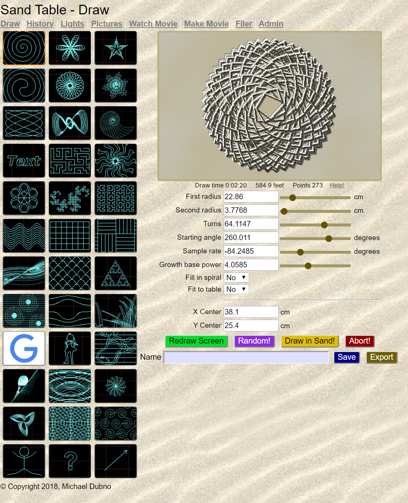
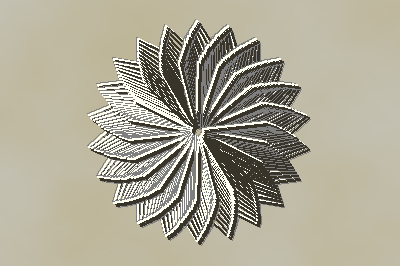
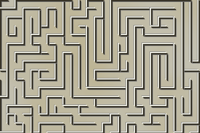

# SandTable

SandTable provides a web-based user interface to control artistic mechanisms built on CNC platforms, particularly machines that use an x/y motion stage to move a magnet and move a steel ball through sand.

## Getting Started

### Software:
Everything you need to control a SandTable is included in this project. You only need a Raspberry Pi, a CNC controller, an actual table, and some optional LED lights. The software is easy to install and use.  A web-based interface allows you to draw a huge number of mathematically created paterns, write text, draw clipart, and even automatically find and draw images from Google.

The SandTable system is designed to make it easy to add new drawing methods and lighting schemes.

The software also has some neat additional features:
* A scheduler that can wake up and draw a random image.
* A movie mode that runs through a script of keyframe drawings, automatically interpolates intermediate frames, and triggers a camera to take pictures. The pictures are then assembled into an animated movie.
* A filer for managing clipart, movies, and pictures.

### Hardware:
While you can use SandTable to generate interesting pictures on a screen, the real benefit comes by driving a CNC machine. Machines need to have a smooth (and preferably quiet) x/y motion stage with a magnet in the center. It takes a bit of effort to tune the power/distance of the magnet, the size of the ball, and the amount and type of sand. If the magnet isn't powerful enough the ball will bury and stop in the sand while the magnet continues.  If the magnet is too strong then the friction of the magnet, ball, and sand can lead to stepper motors stalling, missing steps, and making grinding noise.

The hardware should include a homing switche for each axis.  Each machines dimensions, motor speeds, accelerations, ports, etc. can be configured.

### Modifications:
Many people want to add some fun bells and whistles like:
* Ball changers (electromagnets, barriers, different size balls, etc.)
* Multiple balls moving simultaneously
* Clearing mechanisms (wipers, vibration, etc.)
* Magnetic sand
* Ferrofluid
* Ball levitation

After years of playing with SandTables, I think you'll find most of these modifications to be disappointing. However, if you do come up with something that you feel is compelling, we should definitely add it to the code.

#### Lighting
I highly recommend adding controllable LED lighting and support already exists for:
* [DotStar](https://learn.adafruit.com/adafruit-dotstar-leds/overvie://learn.adafruit.com/adafruit-dotstar-leds/overview) Best LED strips from [Adafruit](https://www.adafruit.com/category/885).
* [Fadecandy](https://github.com/scanlime/fadecandy) Versatile NeoPixel LED controller.
* [OPC](http://openpixelcontrol.org/) Open Pixel Control (also used in FadeCandy).
* [ColorKinetics](https://www.colorkinetics.com/global) Large industrial lighting manufacturer.

#### Supported CNC Controllers:
* [TinyG](https://synthetos.myshopify.com/products/tinyg) Full-featured controller.
* [Smoothieboard](http://smoothieware.org/smoothieboard) Inexpensive machine controller.
* [Marlin](https://github.com/MarlinFirmware/Marlin) Simple CNC controller.
* [EMC](http://linuxcnc.org/) Linux CNC Enhanced Machine Controller.

### Examples:
* [Michael Dubno's first table](https://makezine.com/2009/08/10/new-york-city-sand-table-project/)
* [Michael Dubno's first table](http://www.atelier-automatik.com/sandtable.html)
* [Mark Rehorst's table](https://drmrehorst.blogspot.com/2018/10/a-3d-printed-sand-table-spice-must-flow.html)

## Built With:
* [numpy](https://numpy.org/) - Python N-dimensional array package
* [pypotrace](https://pypi.org/project/pypotrace/) - Python bindings to potrace
* [potrace](http://potrace.sourceforge.net/) - Bitmap image to vector conversion
* [scipy](https://www.scipy.org/) - Python science/math package
* [pillow](https://pillow.readthedocs.io/en/stable/) - Python image package
* [bottle](http://bottlepy.org/docs/dev/) - Lightweight Python web framework
* [shapely](https://pypi.org/project/Shapely/) - Python interface to GEOS to operate on planar geometry
* [apscheduler](https://apscheduler.readthedocs.io/en/latest/) - Advanced Python scheduler
* [sqlalchemy](https://www.sqlalchemy.org/) - Python SQL toolkit and object relational manager
* [fontTools](https://github.com/fonttools/fonttools) - Python library for manipulating fonts
* [gphoto2](https://github.com/jim-easterbrook/python-gphoto2) - Python control of cameras
* [blinka](https://pypi.org/project/Adafruit-Blinka/) - Adafruit Circuitpython device control

## Deployment:

The system is happy running on Linux (prefered), Macs, and PCs.  Raspberry Pi running Raspbian is the prefered (and most tested) platform. Other platforms require hand-tweaking the installation.

### Raspberry Pi Installation (tested on 2,3,3b+,and 4):
Set the hostname of your machine
cd sandtable
bin/install.sh

Configure your controller:
* Copy an existing configuration and modify it to fit your machine.
* Edit src/config/hostmap.py and add your host name and config file name.

Restart the machine.

You should be able to use a browser -
* on the machine you can use: http:localhost
* off the machine you can use: http:hostname (if your DNS/DHCP server is setup correctly

Logs are written to:
* Server logs - /var/logs/sandtable.log
* CNC Machine logs - /var/logs/machd.log
* LED Lighting logs - /var/logs/ledaemon.log
* Scheduler logs - /var/logs/scheduler.log

### To Do:
* Add test code
* Improve scheduler interface
* Improve lighting scenes
* Make the web interface more interactive
* Move common items from machines Leds into ledaemon
* Rename code for more consistency (ledstuff, ledaemon, etc.)
* Condense Polylines and Chains
* Add export gcode, thr, svg and perhaps dxf. Make export return files.
* Add playlists
* Fix units display (and estimation) in Chains and cgidraw

## Authors:

* **Michael Dubno**

## License

This project is licensed under the GNU GPL License - see the [LICENSE](LICENSE) file for details

## Acknowledgments

* A big thanks to the entire open-source community who provided a wonderful OS (Linux), a great language (Python), and hundreds of useful libraries which made this project substantially easier to develop.
* This project came about because of a trip to Dean Kamen's house over Christmas. His house is filled with wonderful machines that combine art and science that have been custom built for him. Around New Years I caught Fifth's disease which took over a month to be diagnosed, so I designed my own art and science machine, the sandtable, which I immediately constructed after recovery.
